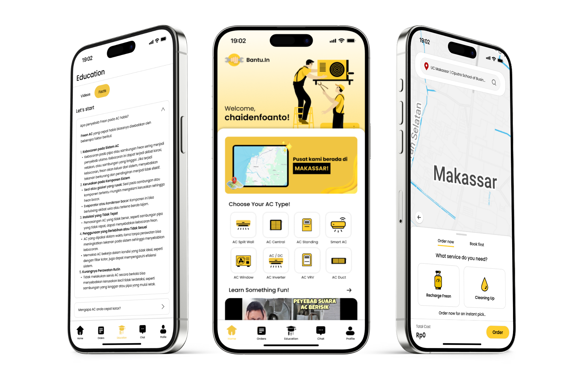

# Frontend Bantu.In

<p align="center">
  
</p>

**Bantu.In** adalah aplikasi yang mempermudah masyarakat dalam menemukan layanan jasa tukang profesional dengan mudah, cepat, dan terpercaya. Proyek ini hadir sebagai solusi untuk mengatasi berbagai tantangan, seperti kesulitan menemukan tukang yang kompeten, kendala ketidaksesuaian jadwal, hingga ketidaknyamanan akibat janji tukang yang sering tidak ditepati.

---

## Tentang Proyek

Aplikasi ini ditargetkan untuk membantu dua pihak utama:  
1. **Pelanggan**: Individu atau keluarga yang membutuhkan layanan berkualitas, termasuk para perantau dan pekerja kantoran.  
2. **Tukang**: Para penyedia layanan jasa yang ingin mendapatkan pelanggan dengan lebih mudah dan meningkatkan profesionalisme mereka.  

Proyek ini dibangun menggunakan teknologi **Flutter** untuk memastikan performa yang optimal di berbagai platform, serta menonjolkan antarmuka pengguna yang sederhana, intuitif, dan ramah pengguna.

---

## Fitur Utama

Berikut adalah fitur-fitur unggulan yang ditawarkan oleh **Bantu.In**:
1. **Pemesanan Real-time dan Terjadwal**  
   Pelanggan dapat memilih pemesanan langsung (instan) atau memesan sesuai jadwal yang diinginkan.  
2. **Edukasi**  
   Menyediakan video dan artikel seputar layanan rumah tangga, seperti perawatan AC, atau perbaikan lainnya.   
3. **Profil Tukang Lengkap**  
   Menampilkan informasi tukang, termasuk foto, sertifikasi, ulasan pelanggan, dan rating.  
4. **Rating dan Review**  
   Memberikan transparansi untuk pelanggan dalam memilih layanan terbaik.  

---

## Mockup Aplikasi

Berikut adalah cuplikan antarmuka aplikasi **Bantu.In**:

<p align="center">
  
</p>

---

## Teknologi yang Digunakan

- **Flutter**: v3.24.5
- **Dart**: v3.5.4
- **Visual Studio Code**: IDE untuk project development.

---

## Struktur File

Berikut adalah struktur file utama dari proyek ini:
  ```
    lib/
    ├── widgets/                     
    │   ├── custom_map_widget.dart   
    │   ├── map_service.dart         
    │   ├── navbar.dart              
    │   ├── service_options.dart     
    │   └── terms_conditions.dart    
    ├── app.dart                     
    ├── booking.dart                 
    ├── chat.dart                    
    ├── dashboard.dart               
    ├── education.dart               
    ├── login.dart                   
    ├── main.dart                    
    ├── onboarding_screen.dart       
    ├── orders.dart                  
    ├── profile.dart                 
    ├── register.dart                
    └── splash_screen.dart           
  ```

---

## Instalasi

Ikuti langkah-langkah di bawah ini untuk menjalankan proyek secara lokal:

1. **Clone repositori ini**:
   ```bash
   git clone https://github.com/chaidenfoanto/Group-3_Bantu.In_FRONTEND.git
   ```

2. **Masuk ke direktori proyek**:
    ```bash
    cd Group-3_Bantu.In_FRONTEND
    ```

3. **Pasang dependensi proyek**:
    ```bash
    flutter pub get
    ```

4. **Jalankan aplikasi di emulator atau perangkat fisik**:
    ```bash
    flutter run
    ```

---

## Kontribusi terhadap Sustainable Development Goals (SDGs)

Proyek **Bantu.In** mendukung pencapaian beberapa tujuan dalam Sustainable Development Goals (SDGs), khususnya:

1. **SDG 8: Decent Work and Economic Growth**  
   Membuka peluang kerja yang lebih layak bagi para tukang dengan menyediakan platform profesional yang memungkinkan mereka untuk menawarkan jasa secara lebih efisien dan terorganisir. Selain itu, fitur manajemen jadwal dan sertifikasi tukang juga mendorong peningkatan kompetensi dan kredibilitas mereka.

2. **SDG 1: No Poverty**  
   Memberikan akses kepada para tukang untuk mendapatkan penghasilan yang lebih stabil melalui peluang kerja yang terorganisasi dan berkelanjutan. Dengan platform ini, tukang dapat terhubung langsung dengan pelanggan tanpa perantara, sehingga potensi pendapatan mereka lebih optimal.

---

## Development Team

Proyek ini dikembangkan oleh tim **Bantu.In Development Team**, yang terdiri dari:

1. **Chaiden Richardo Foanto**  
2. **Franklin Jaya** 
3. **Edrick Saptura Lionard** 
4. **Calvin Ritchie Rumendong** 

Kami bekerja sama untuk menghadirkan aplikasi **Bantu.In** yang dapat memberikan dampak positif bagi masyarakat serta membantu menyelesaikan permasalahan dalam dunia layanan jasa.

